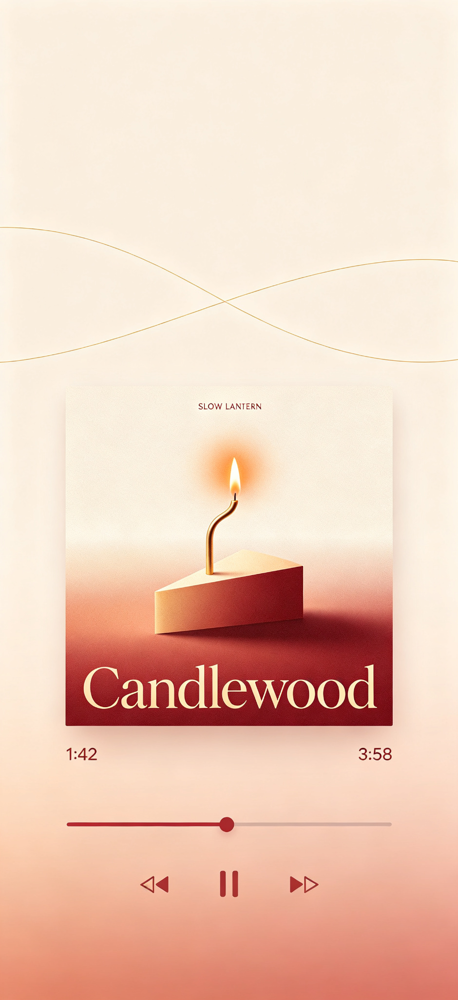
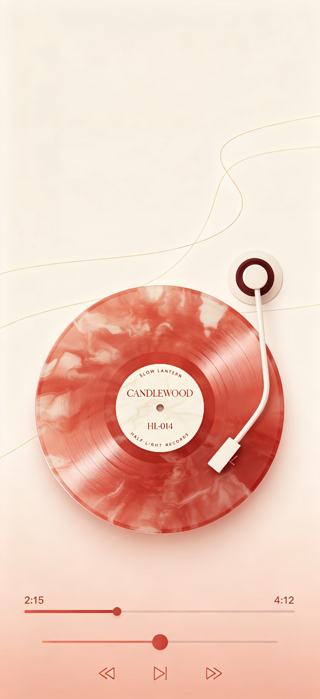

# vinyl-wallpaper-generator

[English](README.md) | [简体中文](README.zh-CN.md)

Turn a photo, memory, sentence, emotion, story, object, or place into **two matching fictional-vinyl-themed mobile wallpapers** — a cover-art version and a single-record version with tonearm.

Built as an agent Skill (SKILL.md convention).

## Examples

| Cover Wallpaper | Record Wallpaper |
|:---:|:---:|
|  |  |

Both are **9:19.6 portrait**, with a light gradient background, hairline decorative curves, no system UI, and a minimalist player bar at the bottom. The record version includes a tonearm with the stylus resting on the outer groove.

## What it does

Given a source photo or a text idea, the skill analyzes the source, builds a fictional vinyl release (artist, album, label, tracklist — artist names are web-search-verified), designs the visual system, and generates two wallpapers in parallel.

## Installation

Tell your agent to install it — no manual cloning needed:

> *"帮我安装 vinyl-image-generator 这个技能，仓库地址是 https://github.com/Irisnotiris/vinyl-wallpaper-generator"*

The agent will clone the repo into your skills directory automatically.

## Usage

Invoke naturally:

- *"用 vinyl-wallpaper-generator 把这张照片做成壁纸"*
- *"Turn this memory into two vinyl wallpapers"*
- *"把'我们活着如同独自做梦'做成两张黑胶手机壁纸"*

## Repository structure

```
vinyl-wallpaper-generator/
├── SKILL.md                          # Main skill document
├── README.md                         # English readme
├── README.zh-CN.md                   # Chinese readme
├── LICENSE
├── references/
│   └── prompt_templates.md           # Image-generation prompt templates
└── examples/
    ├── cover-wallpaper.png
    └── record-wallpaper.png
```

## License

MIT
